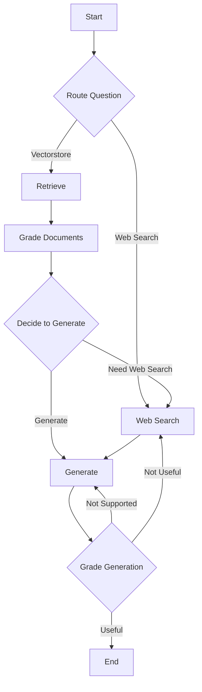

# Agentic RAG

[](https://opensource.org/licenses/MIT)
[](https://www.python.org/downloads/)

A sophisticated Retrieval-Augmented Generation (RAG) system with agentic capabilities, built using LangGraph. This project implements an advanced RAG pipeline that can retrieve information from a vector database, perform web searches, grade document relevance, and generate grounded answers while minimizing hallucinations.

## Features

- **Intelligent Routing**: Automatically routes questions to either vectorstore retrieval or web search based on the query type.
- **Document Grading**: Evaluates the relevance of retrieved documents to ensure high-quality information.
- **Web Search Integration**: Incorporates real-time web search using Tavily for up-to-date information.
- **Hallucination Detection**: Grades generated answers for grounding in provided documents.
- **Answer Quality Assessment**: Ensures generated responses adequately address the original question.
- **Vector Storage**: Uses ChromaDB for efficient document storage and retrieval.
- **Modular Architecture**: Built with LangGraph for easy extension and customization.

## Architecture

The system follows a graph-based architecture with the following flow:



## Installation

1. **Clone the repository:**
   ```bash
   git clone https://github.com/yourusername/agentic-rag.git
   cd agentic-rag
   ```

2. **Create a virtual environment:**
   ```bash
   python -m venv .venv
   # On Windows
   .venv\Scripts\activate
   # On macOS/Linux
   source .venv/bin/activate
   ```

3. **Install dependencies:**
   ```bash
   pip install -e .
   ```

4. **Set up environment variables:**
   Create a `.env` file in the root directory with your API keys:
   ```
   OPENAI_API_KEY=your_openai_api_key
   TAVILY_API_KEY=your_tavily_api_key
   ```

5. **Run data ingestion:**
   ```bash
   python ingestion.py
   ```

## Usage

Run the main application:

```bash
python main.py
```

This will execute a sample query: "what is agent memory?"

To modify the query, edit the `main.py` file.

## Project Structure

```
agentic-rag/
├── ingestion.py          # Data ingestion and vectorstore setup
├── main.py              # Main entry point
├── pyproject.toml       # Project configuration
├── README.md            # This file
└── graph/
    ├── __init__.py
    ├── consts.py        # Constants
    ├── graph.py         # LangGraph workflow definition
    ├── state.py         # Graph state definition
    ├── chains/
    │   ├── __init__.py
    │   ├── answer_grader.py     # Grades answer quality
    │   ├── generation.py        # Answer generation chain
    │   ├── hallucination_grader.py  # Detects hallucinations
    │   ├── retrieval_grader.py  # Grades document relevance
    │   ├── router.py            # Routes questions
    │   └── tests/
    │       ├── __init__.py
    │       └── test_chains.py
    └── nodes/
        ├── __init__.py
        ├── generate.py          # Generation node
        ├── grade_documents.py   # Document grading node
        ├── retrieve.py          # Retrieval node
        └── web_search.py        # Web search node
```

## Dependencies

- **LangChain**: Framework for building LLM applications
- **LangGraph**: Library for creating stateful, multi-actor applications
- **ChromaDB**: Vector database for document storage
- **OpenAI**: LLM provider for embeddings and generation
- **Tavily**: Web search API
- **BeautifulSoup4**: HTML parsing for web loading
- **Python-dotenv**: Environment variable management

## Contributing

1. Fork the repository
2. Create a feature branch (`git checkout -b feature/amazing-feature`)
3. Commit your changes (`git commit -m 'Add some amazing feature'`)
4. Push to the branch (`git push origin feature/amazing-feature`)
5. Open a Pull Request

## License

This project is licensed under the MIT License - see the [LICENSE](LICENSE) file for details.

## Acknowledgments

- Inspired by Lilian Weng's blog posts on agents and prompt engineering
- Built using the LangChain and LangGraph frameworks</content>
<parameter name="filePath">d:\AI\agentic-rag\README.md